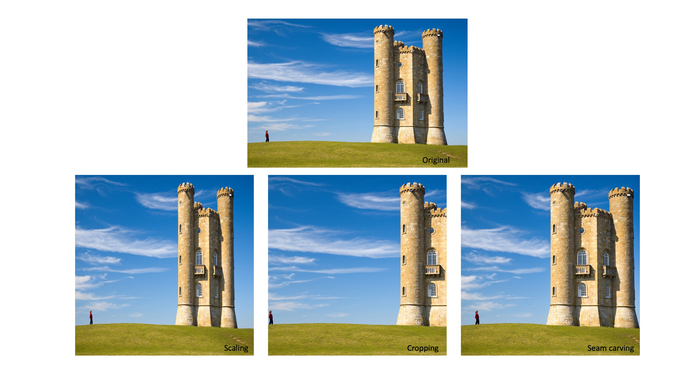
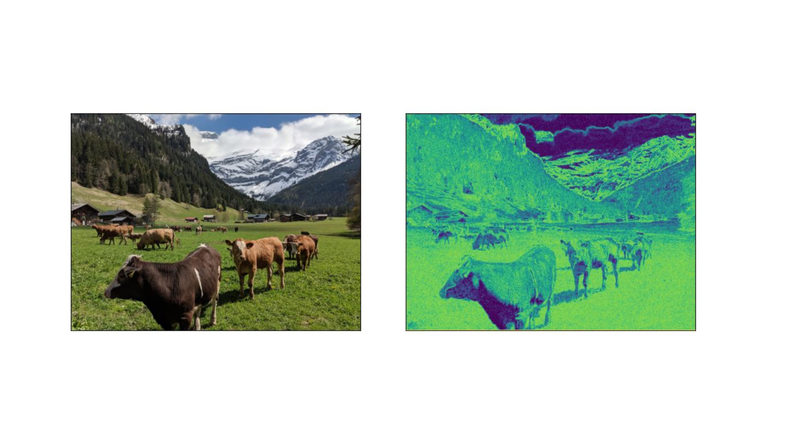
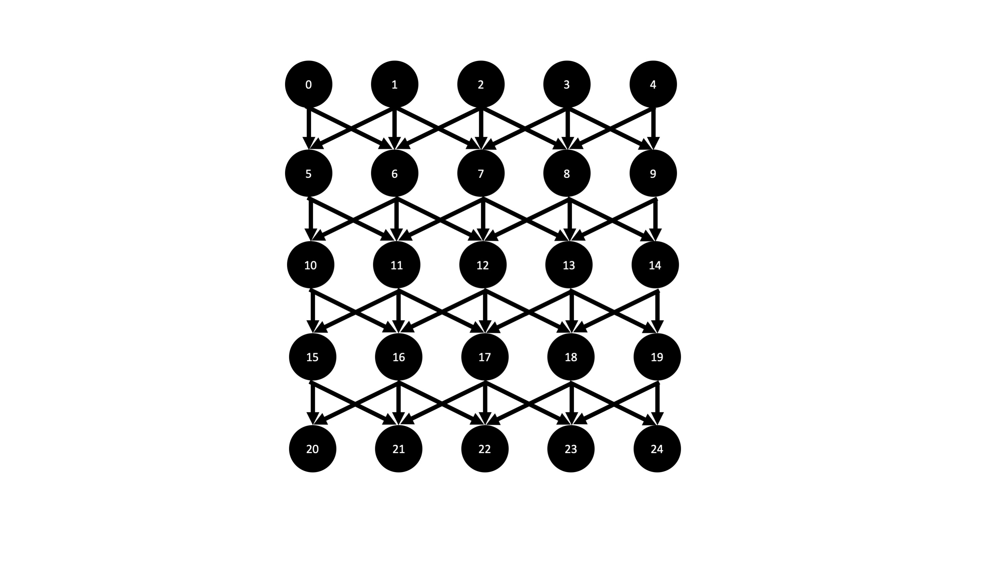
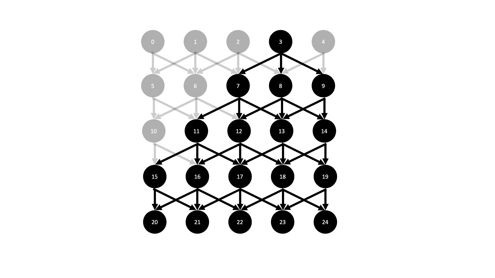
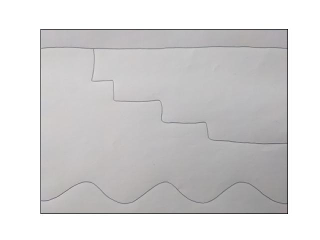
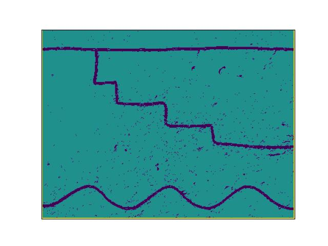
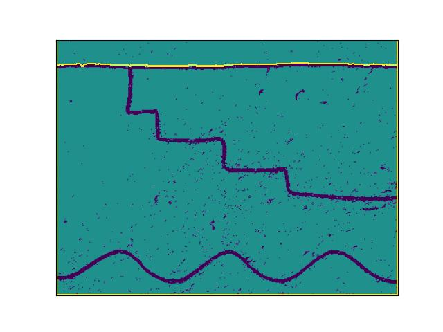

# seam-carving

Seam carving is a classic image processing algorithm that is used to resize an image in a way that intelligently preserves important image details.  While there are numerous resources out there to learn more about seam carving, including the [original paper](https://dl.acm.org/doi/10.1145/1275808.1276390) from 2007 and the [wikipedia page](https://en.wikipedia.org/wiki/Seam_carving), I had so much fun coding this up that I wanted to post my version of this classic algorithm too.  First, a quick example (images from [wiki](https://en.wikipedia.org/wiki/Seam_carving)).



The above shows three ways to resize an image to be narrower.  The original image is shown on the top.  One option is scaling (bottom left), but this distorts the image features, making the castle appear narrower than it is in the original.  The second option is cropping (bottom center), but this cuts off the whole right side of the castle.  The only option that preserves important image details is seam carving (bottom right).

# Into the Weeds

The basic insight of the seam carving algorithm is that not all pixels are created equal.  That is to say, in any image, certain pixels will invariably be more important than others in conveying the image content.  When we resize an image in a naive way, say by cropping it, we are making an implicit judgment that the pixels on the cropped edges are least important and those near the center are most important.  While this may be true for certain classes of images, like portraits, it is certainly not a universal rule, as the example above illustrates.  Seam carving algorithms attempt to quantify pixel importance in various ways.  The present implementation associates the importance, or energy, of a given pixel with the magnitude of the intensity gradient across its neighbors.  Here is a look at that calculation (found in the constructor of the `SeamCarver` class):

```python
import numpy as np
import PIL
from PIL import Image

im = np.array(Image.open('.../image.png')) #import an image file and convert to numpy array
energy = 1e3*np.ones((im.shape[0],im.shape[1])) #initialize the energy to large values 

#Compute x and y gradients, summed over color channels
Dx2 = np.sum((im[2:,1:-1,:] - im[:-2,1:-1,:])**2,axis=2) #x gradients
Dy2 = np.sum((im[1:-1,2:,:] - im[1:-1,:-2,:])**2,axis=2) #y gradients

energy[1:-1,1:-1] = (Dx2 + Dy2)**0.5 #add x and y gradients and assign them to the energy array

```

Here is an example of an original image (left, Swiss cows are happy cows) and the resulting energy function (right):



We see that high energies are assigned to areas of the image where there is a lot of visual activity -- this can be the edge of an object, the detail of an intiricate pattern like a face or a cloud, or any other feature where color or intensity is rapidly changing as a function of pixel position.  

Given this energy array, the seam carving task is now to systematically remove pixels with the lowest energies in a way that does not disturb the continuity of the image.  Say, for instance, that we want to reduce the width of the image.  This means that we would like to remove a certain number of columns from the pixel array representing the image.  Removing a column is equivalent to removing one pixel from each row.  In choosing pixels to remove, the seam carving algorithm imposes two conditions: (1) the set of pixels to be removed must form a connected path, and (2) the sum of the energies of the removed pixels must be minimized.  In other words, we are seeking a continuous path of pixels, leading from the top of the image to the bottom and including exactly one pixel in each row, such that the energy along that path is a minimum.     

It turns out that this task falls into a larger class of problems in graph theory related to finding the [shortest path](https://en.wikipedia.org/wiki/Shortest_path_problem) in a graph.  Luckily, the seam carving task involves a particularly simple graph, called a directed acyclic graph, in which each edge has a direction associated with it and there exists no vertex such that a directed path leads from that vertex back to itself.  To make this concrete, here is an illustration of the graph structure that we will use to represent an image (here simplified to be a 5x5 pixel array):



Each black circle, or vertex, represents a pixel and each pixel is connected by a directed edge to its neighbors in the row below.  This graph structure is appropriate because we are seeking a continuous path from the top row to the bottom, meaning that each pixel can lead only to its neighbors in the next row down.  Every vertex in this path has an index (the number in white) and a value (the energy of that pixel, not shown).  To find the lowest energy seam, we consider paths leading from each possible source vertex in the top row, and then choose the path with the lowest energy.  As an example, let's consider paths leading from vertex 3.  Shown below are all vertices that are reachable from vertex 3.



We construct a list of these vertices with the following function:

```python
def topoSort(s,im): 
	#a function to create a list of vertices in the image im accessible from vertex s in topological order
	nrows = im.shape[0]
	ncols = im.shape[1]
	topo = []
	for r in range(nrows):
		left_edge = max(s + r*ncols - r, r*ncols)
		right_edge = min(s + r*ncols + r, r*ncols + ncols - 1)
		for v in range(left_edge,right_edge+1):
			topo.append(v)

	return topo

s=3
topOrder = topoSort(s,energy) #topological order of vertices accessible from vertex 3 in the energy array
``` 

This list has the very important property that it is in topological order, meaning that edges point in only one direction along the list (i.e. there exist no edges pointing from `topOrder[i]` to `topOrder[j]` if `i>=j`).  Now, the most efficient algorithm for finding the shortest path in a directed acyclic graph is simply to [relax edges in topological order](https://www.geeksforgeeks.org/shortest-path-for-directed-acyclic-graphs/).

```python
distTo = np.full(V,np.inf) #distTo[i] is the shortest path found so far to vertex i 
edgeTo = np.full(V,np.nan) #edgeTo[i] is the vertex leading to vertex i along the shortest path found so far
distTo[s] = self.e[s] #initialize the source vertex

for v in topOrder: 
	#For each vertex v in topological order, define adj, a list of vertices to which v is attached.
	#Each vertex is attached to its nearest neighbors in the row below.

	#handle bottom row
	if v >= ncols*(nrows-1):
		adj = []
	#handle left edge
	elif v%ncols == 0:
		adj = [v+ncols,v+ncols+1]

	#handle right edge
	elif v%ncols == ncols - 1:
		adj = [v+ncols,v+ncols-1]

	#handle all other pixels 
	else:
		adj =[v+ncols-1, v+ncols, v+ncols+1]


	#relax edges in topological order
	for w in adj:
		if distTo[w] > distTo[v] + self.e[w]:
			distTo[w] = distTo[v] + self.e[w]
			edgeTo[w] = v
```

It really could not be simpler!  In the code file seamCarving.py, this is carried out for each possible source vertex in the top row, storing path lengths along the way, and saving the minimum path length to return at the end of the call.  The code also has the capability to remove a path from the image (i.e. reduce the size of the image by one pixel along an axis) and to do the same for horizontal seams running from left to right across the image.


# A Shortest Paths Example

To demonstrate the relationship between seam carving and finding the shortest path, here is a simple example of using the seam carving algorithm to find the shortest way through a hand drawn maze.



Obviously, the shortest path across the page is the straight line.  Let's see if seam carving can get it right!

In this case, we are actually going to be looking for a path with *maximum* energy, since the gradient will be larger where there is ink on the page.  To accomodate this, we modify our `SeamCarver` class to compute a binary energy function that is proportional to the negative gradient.

```python
class SeamCarver():
	#A class for structuring the seam carving algorithm
	def __init__(self, filepath, scale):
		#load image from filapath and convert to numpy array
		im = Image.open(filepath)
		tmp = np.array(im).shape
		im = im.resize((int(scale*tmp[1]),int(scale*tmp[0])))
		im = np.array(im)
		self.im = im

		#vectorized calculation of dual-gradient energy function 
		self.energy = 1e3*np.ones((im.shape[0],im.shape[1]))

		Dx2 = np.sum((im[2:,1:-1,:] - im[:-2,1:-1,:])**2,axis=2)
		Dy2 = np.sum((im[1:-1,2:,:] - im[1:-1,:-2,:])**2,axis=2)

		self.energy[1:-1,1:-1] = -1*((Dx2 + Dy2)**0.5>7) #<---threshold the energy and take its negative!
		self.e = self.energy.flatten()
```

The resulting energy image for the hand drawn maze is shown below (blue is more negative):



Luckily, negative weights are no problem for the shortest paths algorithm on a directed acyclic graph, so we can simply run the following code and plot the result.

```python
carver = SeamCarver('.../image.png')
sp,seam,mstore = carver.findHorizontalSeam()
plt.imshow(carver.energy + 100*seam,vmin=-1, vmax=1)
```


The yellow line corresponds to the shortest path found by the algorithm.  Seam carving got it right!  
